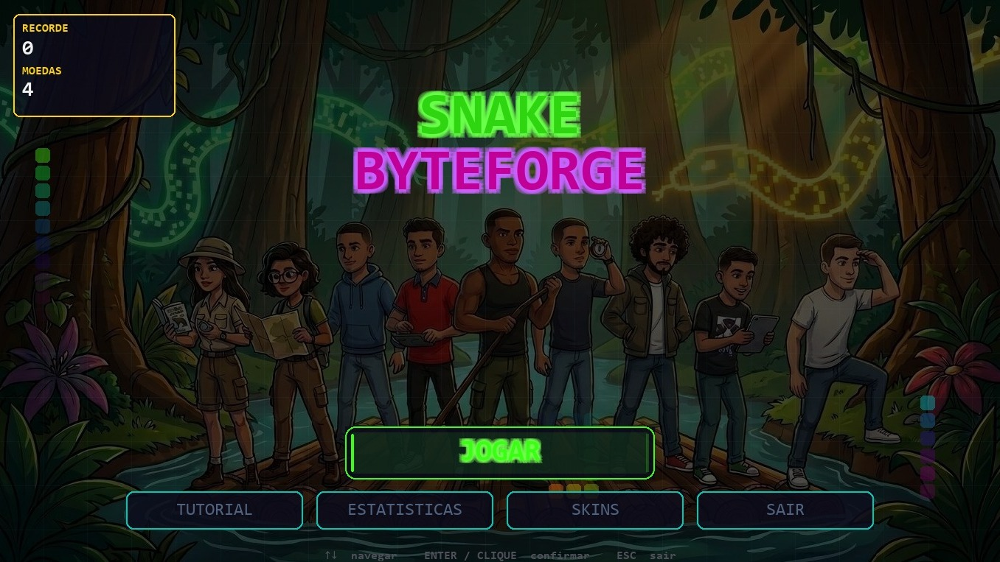
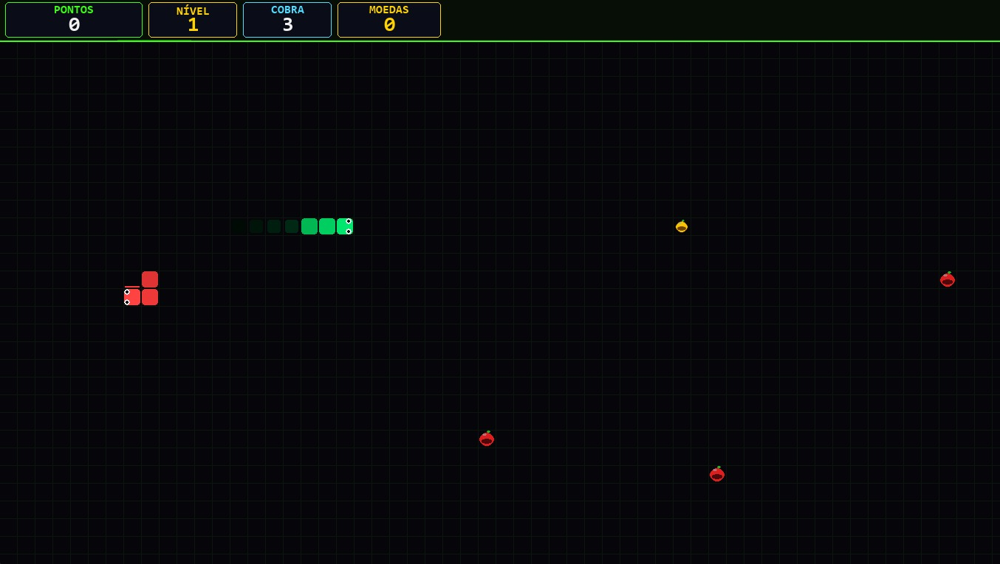

# 🐍 Snake - Byte Forge



## ◼️ Sobre o jogo

Um jogo clássico da cobrinha desenvolvido em Python utilizando a biblioteca Pygame. O objetivo é controlar a cobra, coletar alimentos e alcançar a maior pontuação possível sem colidir com as paredes ou com o próprio corpo.

## 📑 Documentação do Projeto

[GDD - BYTE FORGE](https://github.com/user-attachments/files/29348257/GDD.-.BYTE.FORGE.pdf)

[SDD - BYTE FORGE](https://github.com/user-attachments/files/29348973/SDD.-.BYTE.FORGE.pdf)

## 🎮 Funcionalidades
- Movimentação com as setas do teclado
- Sistema de pontuação
- Crescimento da cobra ao coletar alimentos
- Detecção de colisão
- Tela de Game Over
  
## 🛠️ Tecnologias Utilizadas
- Python 3
- Pygame

## 📦 Instalação

1. Clone o repositório:
   
2. Instale o Pygame:
   ```
   pip install pygame
3. Execute o jogo:
   ```
   python main.py
   
## 🎯 Como Jogar

- Pode ser jogado com as teclas

- ⬆️ Seta para cima: mover para cima

- ⬇️ Seta para baixo: mover para baixo

- ⬅️ Seta para esquerda: mover para esquerda

- ➡️ Seta para direita: mover para direita

- Colete os alimentos para aumentar sua pontuação e evitar colisões.


```text
## 📁 Estrutura do Projeto
jogo-cobrinha/
│
├── docs/
│   ├── imagens/
|   └── gameplay/
│   └── tela_menu/
|── audios/
|   └── botão_menu/
|   └── gameover/
|   └── maca_dourada/
|   └── menu_music/
|   └── modo_classic/
|   └── subir_nivel/
├── main.py
├── README.md
└── requirements.txt
```

## 📸 Capturas de Tela



## 📄 Licença


## 🧑‍🎨 Integrantes do Grupo

- Jeoas Gabriel - Gerente de Projeto

- Sandra Pires - Game Desing

- Eduardo Abreu - Desing
  
- Raynara Gomes - QA tester

- Enzo Gabriel - Programador 

- Paulo Henrique - Artista 2D

- André Marques - Sound Desing

- Lucas Gabryell - Roteirista

- João Pedro - Programador
